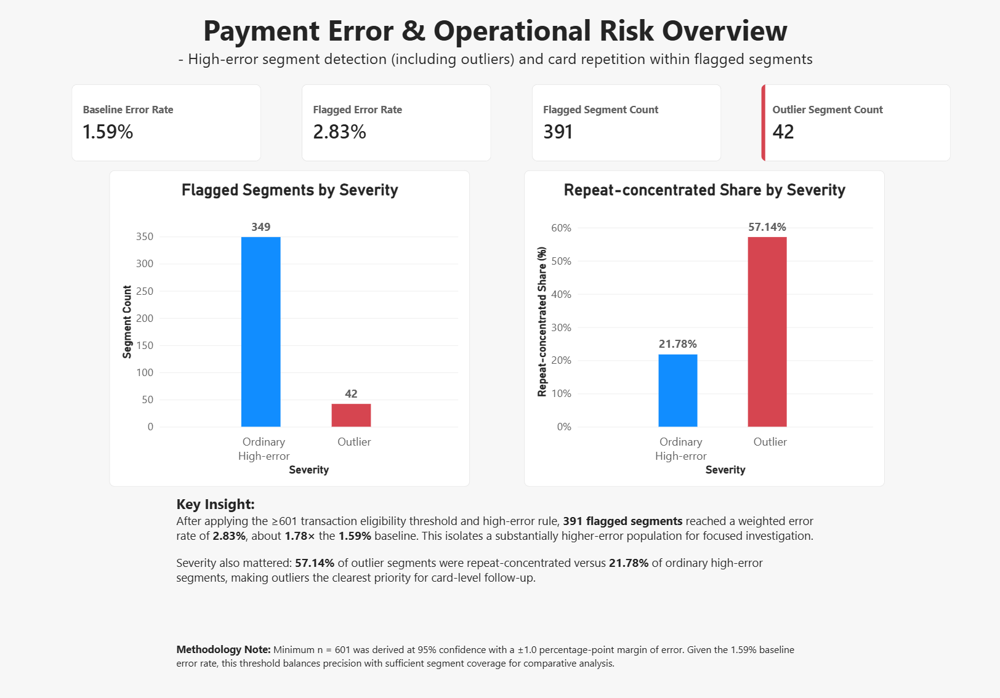
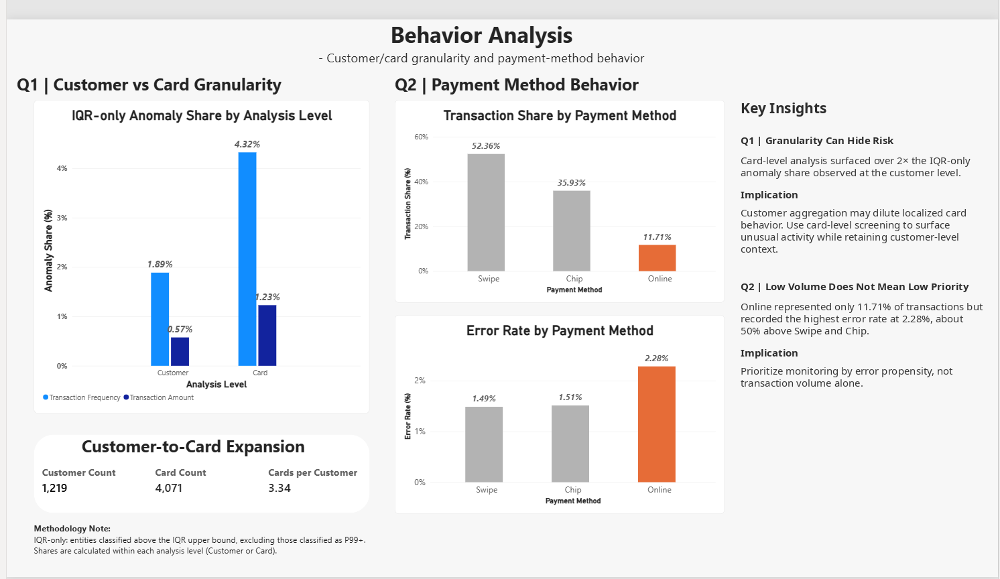
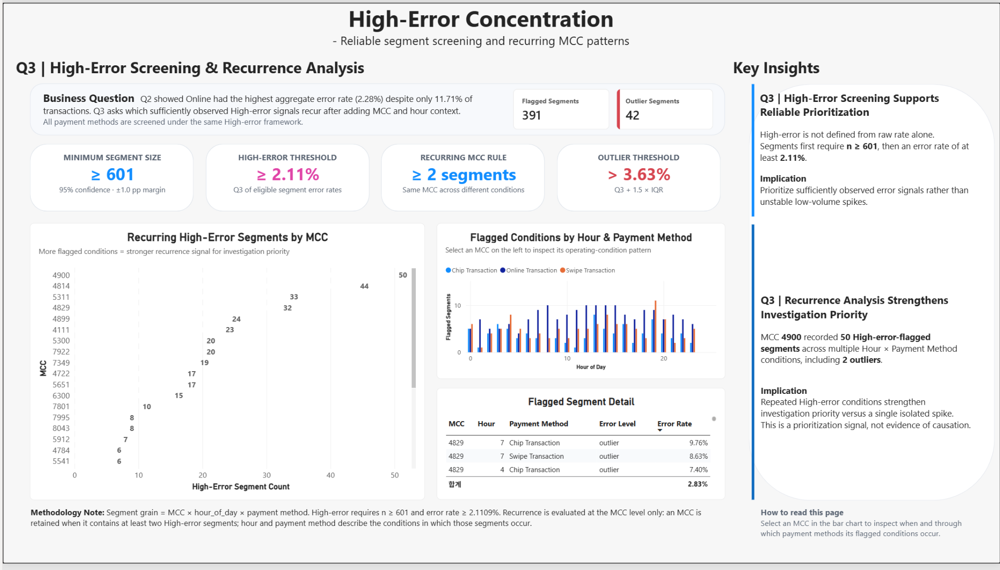
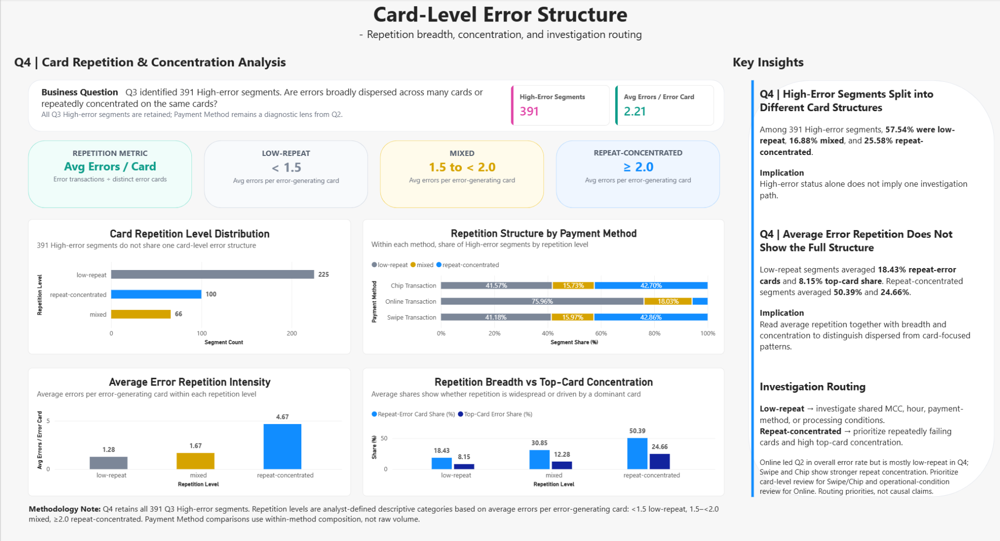
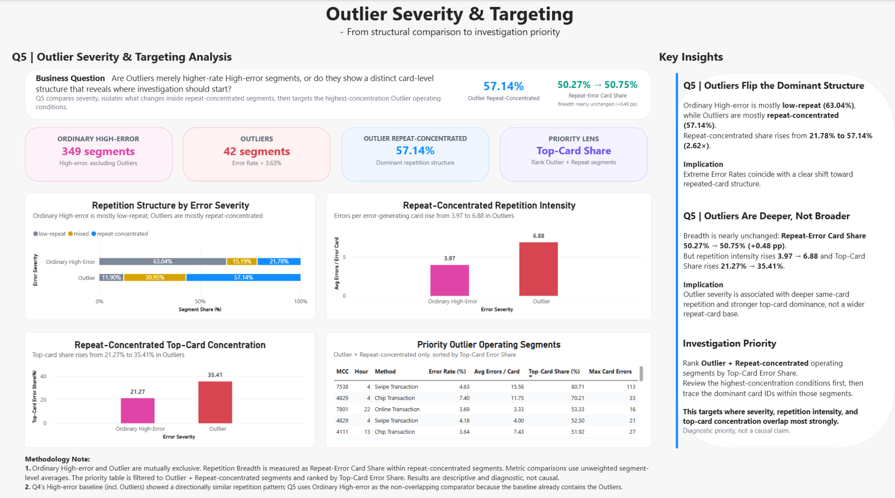

# Payment Error & Operational Risk Analytics

**SQL + Excel cross-validation + Power BI portfolio project** that turns transaction-error data into a reproducible investigation framework: identify reliable high-error operating conditions, explain whether errors are dispersed or card-concentrated, and prioritize the segments where severity and concentration overlap.

**Tools:** MySQL 8+ · Excel · Power BI  
**Scale:** 13.3M+ source transactions · 391 reliable high-error segments · 42 outliers

[View Master SQL](sql/Payment_Error_Operational_Risk_Analytics.sql) · [Open Excel Validation](excel/Payment_Error_Operational_Risk_Analytics.xlsx) · [Download Power BI Report](powerbi/Payment_Error_Operational_Risk_Analytics.pbix)

---

## Executive Overview

[](assets/01_executive_overview.png)

The project screens unstable low-volume spikes before ranking risk. Using a minimum eligible segment size of **601 transactions**, the analysis isolates **391 high-error segments** with a weighted error rate of approximately **2.83%**, versus a **1.59%** baseline. Outliers are structurally more repeat-concentrated than ordinary high-error segments.

## Investigation Framework

| Stage | Analytical question | Final takeaway |
|---|---|---|
| **Q1** | Can aggregation hide localized card behavior? | Card-level screening surfaces materially more localized anomaly behavior than customer-level aggregation. |
| **Q2** | Which payment method deserves attention? | Online is only **11.71%** of transactions but has the highest aggregate error rate at **2.28%**. |
| **Q3** | Which high-error signals are reliable enough to investigate? | Require **n ≥ 601**, then apply high-error/outlier thresholds at `MCC × hour × payment method`. |
| **Q4** | Are errors dispersed or repeatedly concentrated on the same cards? | **57.54%** low-repeat, **16.88%** mixed, **25.58%** repeat-concentrated. |
| **Q5** | Where should investigation start? | Outliers are much more often repeat-concentrated: **57.14% vs 21.78%** for Ordinary High-Error. |

---

## Dashboard Walkthrough

https://github.com/user-attachments/assets/45b7a51c-2c51-43c9-bb79-a57debe88694

### Q2 · Behavior Analysis

[](assets/02_behavior_analysis.png)

Customer aggregation can dilute localized card behavior, while payment-method volume alone does not identify operational priority.

### 03 · High-Error Concentration

[](assets/03_high_error_concentration.png)

Q3 establishes a reliable screening population before prioritization: minimum `n`, distribution-based high-error/outlier thresholds, and MCC recurrence across operating conditions.

### 04 · Card-Level Error Structure

[](assets/04_card_level_error_structure.png)

Q4 distinguishes **investigation routing**. Low-repeat structures point first toward shared operating conditions; repeat-concentrated structures justify repeated-card and dominant-card review.

### 05 · Outlier Severity & Targeting

[](assets/05_outlier_severity_targeting.png)
Q5 distinguishes **investigation priority**. Among repeat-concentrated segments, Outliers show deeper repetition intensity and substantially higher top-card concentration.

---

## Key Results

- **Baseline error rate:** 1.59%
- **Minimum eligible segment size:** 601 transactions
- **High-error threshold:** 2.1109%
- **Outlier threshold:** 3.6282%
- **High-error-flagged segments:** 391
- **Ordinary High-Error / Outlier:** 349 / 42
- **Q4 overall segment-level Avg Errors / Error Card:** 2.21
- **Repeat-concentrated Avg Errors / Error Card:** 4.67
- **Outlier repeat-concentrated share:** 57.14%
- **Outlier repeat-concentrated Top-Card Error Share:** 35.41%

GitHub-readable summary exports are available in [`results/`](results/).

---

## Analytical Integrity

The project separates three jobs that are often conflated:

1. **Screening:** Is the observed high error rate sufficiently supported by transaction volume?
2. **Routing:** Is the error structure broadly dispersed or card-concentrated?
3. **Priority:** Where do severity, repetition intensity, and top-card concentration overlap most strongly?

Important interpretation guardrails:

- Q3's `n ≥ 601` rule applies to the **operating segment**, not individual cards.
- Q4 repetition categories are **analyst-defined descriptive routing categories**, not universal statistical standards.
- Q4's overall **2.21 Avg Errors / Error Card** is an **unweighted average of 391 segment-level values**, not a pooled global card ratio.
- Ordinary High-Error and Outlier are mutually exclusive in Q5.
- The project is descriptive and diagnostic; it does **not** claim causality or production fraud detection.

---

## Validation

The workflow uses three validation layers:

**SQL QA → Excel independent cross-validation → Power BI semantic QA**

The Excel workbook contains **16 Q1-Q5 worksheets** that reconstruct key metrics, thresholds, classifications, and structural comparisons from lower-grain SQL outputs. See [Validation Strategy](docs/validation_strategy.md).

---

## Reproduce the Analysis

Raw source files are not committed. To reproduce:

1. Download the public source dataset documented in [`data/README.md`](data/README.md).
2. Load `transactions_data.csv`, `users_data.csv`, and `cards_data.csv` into MySQL as `raw_transactions`, `raw_users`, and `raw_cards`.
3. Run [`sql/Payment_Error_Operational_Risk_Analytics.sql`](sql/Payment_Error_Operational_Risk_Analytics.sql) from top to bottom.
4. Review [`excel/Payment_Error_Operational_Risk_Analytics.xlsx`](excel/Payment_Error_Operational_Risk_Analytics.xlsx) for independent cross-validation.
5. Open [`powerbi/Payment_Error_Operational_Risk_Analytics.pbix`](powerbi/Payment_Error_Operational_Risk_Analytics.pbix) for the interactive dashboard.

---

## Repository Structure

```text
payment-error-operational-risk-analytics/
├── README.md
├── NOTICE.md
├── VERSION_MANIFEST.md
├── assets/
│   ├── 01_executive_overview.png
│   ├── 02_behavior_analysis.png
│   ├── 03_high_error_concentration.png
│   ├── 04_card_level_error_structure.png
│   └── 05_outlier_severity_targeting.png
├── sql/
│   └── Payment_Error_Operational_Risk_Analytics.sql
├── excel/
│   └── Payment_Error_Operational_Risk_Analytics.xlsx
├── powerbi/
│   └── Payment_Error_Operational_Risk_Analytics.pbix
├── results/
│   ├── q2_payment_method_summary.csv
│   ├── q3_screening_summary.csv
│   ├── q4_repetition_level_summary.csv
│   └── q5_severity_comparison.csv
├── data/
│   └── README.md
└── docs/
    ├── project_narrative.md
    ├── methodology_and_metrics.md
    └── validation_strategy.md
```

## Detailed Documentation

- [Project Narrative](docs/project_narrative.md)
- [Methodology & Metric Dictionary](docs/methodology_and_metrics.md)
- [Validation Strategy](docs/validation_strategy.md)
- [Version Manifest](VERSION_MANIFEST.md)
- [Dataset / Reproduction Setup](data/README.md)

## Data Source

**Financial Transactions Dataset: Analytics** by ComputingVictor on Kaggle  
https://www.kaggle.com/datasets/computingvictor/transactions-fraud-datasets

Raw source files are intentionally not redistributed in this repository.
